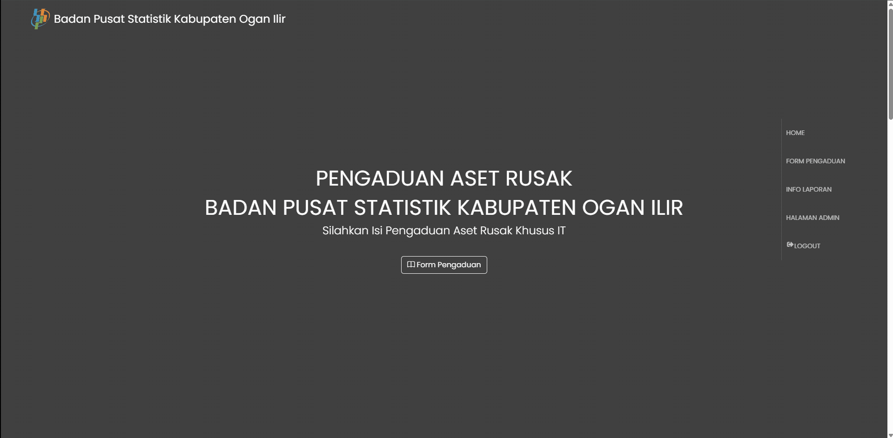
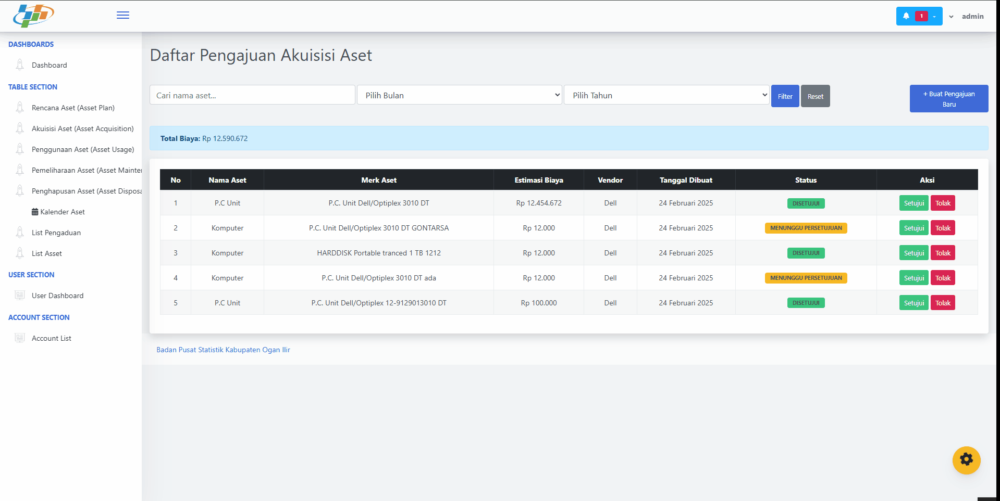
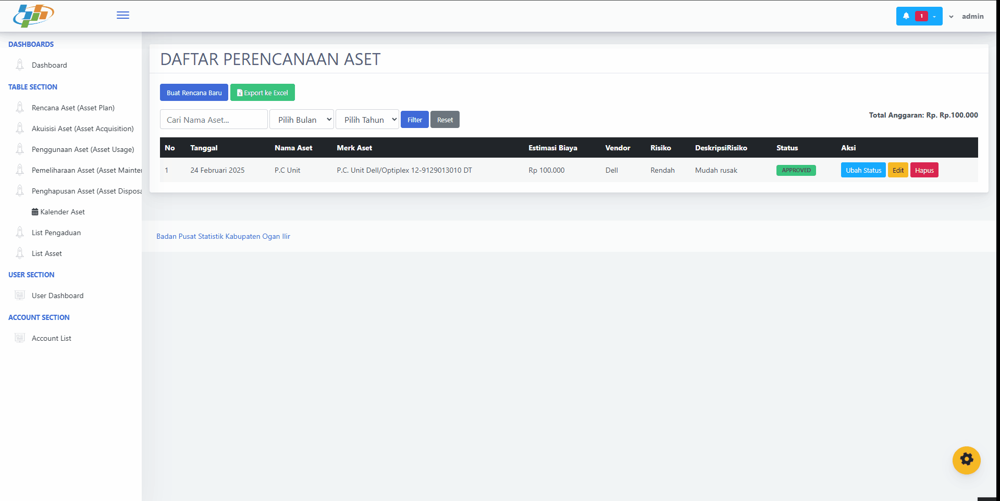
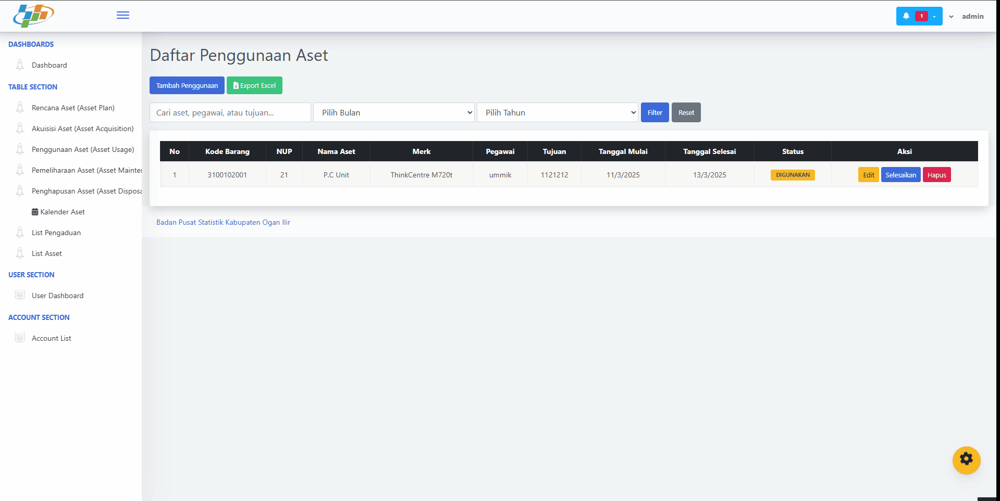
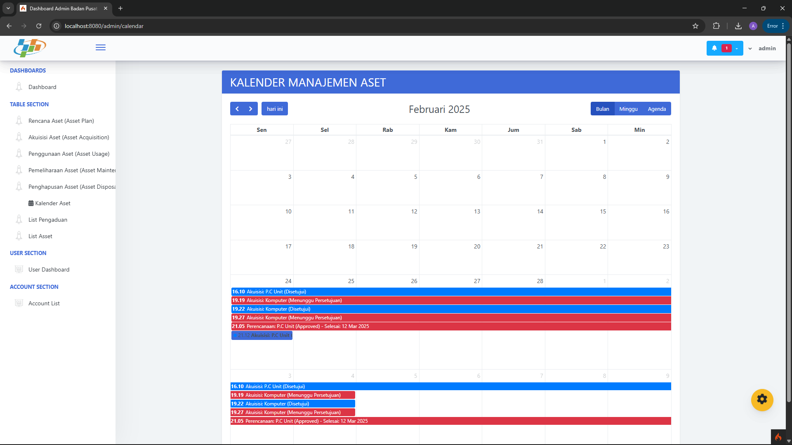
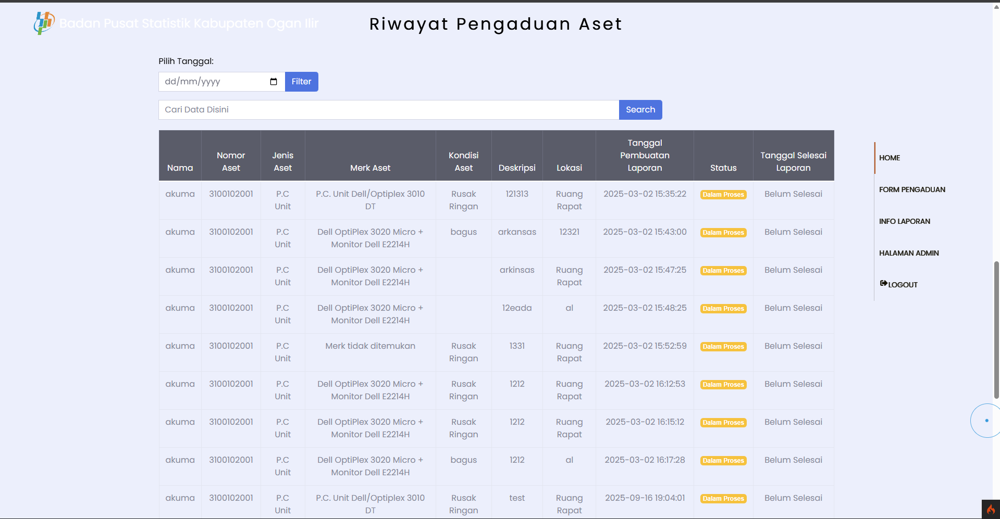

# 🏢 Asset Management System

Sistem Manajemen Aset berbasis web yang dirancang untuk mendukung perencanaan, akuisisi, penggunaan, pemeliharaan, hingga penghapusan aset sesuai standar ISO 55001.

## ✨ Features
- 📊 **Dashboard Admin** – Ringkasan data aset & statistik penting  
- 📝 **Form Pengaduan** – Pengelolaan tiket pengaduan pemeliharaan aset  
- 🗂 **Perencanaan Aset (SAMP)** – Rencana strategis & prediksi kebutuhan  
- 🛒 **Akuisisi Aset** – Pengadaan & manajemen kontrak/vendor  
- 🏷 **Penggunaan Aset** – Monitoring & pencatatan penggunaan aset  
- 📅 **Kalender Pemeliharaan** – Jadwal pemeliharaan & log perbaikan  

## 📸 Preview
> Berikut beberapa cuplikan tampilan sistem:

### 🔑 Landing Page


### 📊 Dashboard Admin


### 📝 Form Pengaduan


### 🛒 Akuisisi Aset


### 🗂 Rencana Aset


### 🏷 Penggunaan Aset


### 📅 Kalender Pemeliharaan


### 🕘 Riwayat Pengaduan


---

## 🚀 Installation
1. Clone repository ini:
   ```bash
   git clone https://github.com/USERNAME/asset-management-system.git
   cd asset-management-system
